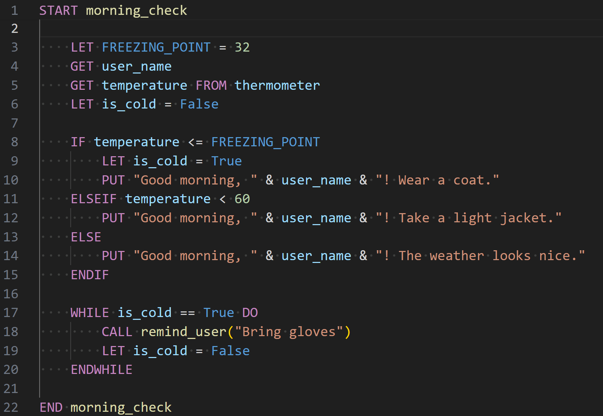

# I2P-Style Pseudocode

Syntax highlighting for [I2P-style pseudocode](https://github.com/i2p-hub/pseudocode) in [Visual Studio Code](https://code.visualstudio.com/).

Designed for introductory programming students, this extension helps you move from algorithm → flowchart → pseudocode → code with clear, readable structure and consistent formatting.

## ✨ Features

- **Custom syntax highlighting** for I2P-style pseudocode  
- **Readable keyword emphasis** (e.g., `START`, `IF`, `WHILE`, `CALL`)  
- **Clear distinction between:**
  - Variables (`lower_case`)
  - Constants (`UPPER_CASE`)
  - Functions and procedures
- **Support for core constructs:**
  - Input / Output (`GET`, `PUT`)
  - Assignment (`LET`)
  - Conditionals (`IF`, `ELSEIF`, `ELSE`, `ENDIF`)
  - Loops (`WHILE`, `FOR`, `FOREACH`)
- **Inline and block comments**, including tagged comments:
  - `TODO`, `FIXME`, `NOTE`, etc.
- **Placeholders / metavariables** using `<...>` for instructional scaffolding  
- **Consistent highlighting across file extensions:**
  - `.i2p`, `.pseudo`, `.pseudocode`, `.psc`

## 📸 Example

> Syntax highlighting in action:



This example demonstrates:
- Program structure (`START` / `END`)
- Input/output operations
- Control flow (conditionals and loops)
- Comments and placeholders

A full test file is available in the repo: `tests\test.i2p`)

# 🌐 Works Everywhere

This extension works in:

- [Desktop VS Code](https://code.visualstudio.com/)  
- [VS Code for EDU](https://vscodeedu.com/)  
- [vscode.dev](https://vscode.dev/)  
- [github.dev](https://github.dev/)  

Perfect for both **local development** and **browser-based learning environments**.

## 🚀 Getting Started

1. Install the extension from the VS Code Marketplace  
2. Open or create a pseudocode file: 
3. Start writing using I2P conventions:
   ```pseudocode
   START example

      GET user_name
      LET message = "Hello, " & user_name
      PUT message

   END example
   ```

## 🎯 Who Is This For?

- Students in **introductory programming (CS1 / I2P)** courses  
- Instructors teaching **algorithm design and pseudocode**  
- Anyone who wants a **structured bridge from logic → code**

## 🧠 Why I2P Pseudocode?

I2P-style pseudocode is designed to:

- Reduce cognitive load for beginners  
- Reinforce **good programming habits early**  
- Provide a **consistent transition to Python and other languages**  
- Align with structured design practices used in real-world development  

## 🏫 About I2P-Hub

**I2P-Hub** is a collection of teaching and learning resources created by programming instructors to support student success in introductory courses.

Our goal is to make early programming concepts:
- Clear  
- Consistent  
- Practical  


## 🔒 Data and Telemetry

This extension **does not collect or transmit any data**.

You can review the source code or [build your own VSIX file](https://code.visualstudio.com/api/working-with-extensions/publishing-extension) from the [GitHub repository](https://github.com/i2p-hub/pseudocode), if desired.

## 📜 License

MIT License © 2026 I2P-Hub

## Acknowledgements

- [Martin Ring](https://raw.githubusercontent.com/martinring/tmlanguage/refs/heads/master/tmlanguage.json) – TextMate grammar schema
- [hanzhi713's ibcs-pseudocode](https://github.com/hanzhi713/ibcs-pseudocode) – inspiration
- [ChatGPT](https://chatgpt.com/share/69c150c8-e594-800d-9002-750ba1792995) – regex refinement support
